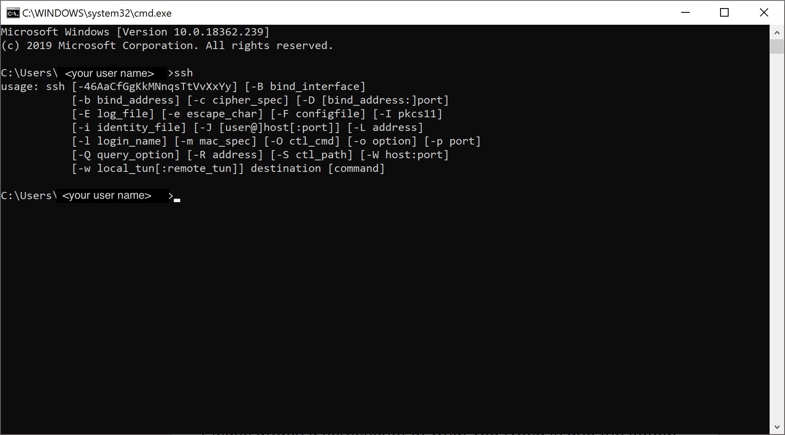
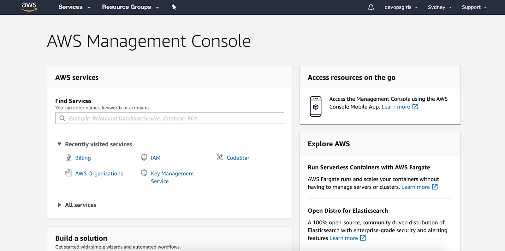

# Before the workshop: preparing your machine

## Your laptop

Please note: you will need access to a laptop and an AWS account on the day.

For the laptop, it is preferred that you have full administrative permissions on the laptop that you bring. If you do not have a personal laptop with full permissions, you may bring your work laptop. Many do not have admin permissions on their work laptops, or have security restrictions for installing software.

This workshop will require at minimum, installation of virtual machine software, at best you have full permissions. Please choose carefully if you are bringing your work laptop, or a personal one.

For the AWS account, please continue with these steps below, to get this set up. The steps are really quite easy and straight forward.

## Windows

If you are bringing a Windows machine, we advise that your operating system is at least Windows 10.

#### SSH

On Windows 10, on your Command Line, you should see this output when typing 'ssh' and pressing Enter:

### If you are not using Windows 10:

Please install PuTTY and PuTTY Gen, following steps 1-3 of section "Generate the key" : https://github.com/DevOps-Girls/devopsgirls-bootcamp/blob/master/8-2-SSH-from-Windows.md

## All machines: Admin privileges

For our workshops, ideally you have a laptop over which you have administrative privileges, meaning you can install software without requiring special permission.  

### If you don't have admin privileges

If you do not have full admin permissions on your laptop, we may provide you with an Ubuntu Linux virtual machine and we will help you use it on the day.

### 1) Windows only

Please install PuTTY and PuTTY Gen, following steps 1-3 of section "Generate the key" : https://github.com/DevOps-Girls/devopsgirls-bootcamp/blob/master/8-2-SSH-from-Windows.md

### 2) All machines

#### 2.1) Virtual machine software

You will require software to run this virtual machine. Ideally you will have VMWare software installed on your laptop, otherwise VirtualBox (free, but may be slow and laggy).

## Your own AWS account

You will be using your own personal basic/ free tier AWS account on the day, that you can manage yourself. If you don't have one yet, keep reading for the link with instructions to create it.

### Creating your own personal account

The link to create a free tier basic personal AWS account: https://portal.aws.amazon.com/billing/signup#/start

The credit card details you provide, are a backup only in case you don't use free tier services.

Don't worry, we will guide you through creating these services on the day.

(here is a list of all free tier services, if you're keen to check them out: https://aws.amazon.com/free/?all-free-tier.sort-by=item.additionalFields.SortRank&all-free-tier.sort-order=asc )

### Log into AWS

Verifying your account. When I log in to AWS, I get a screen that looks similar to this:

