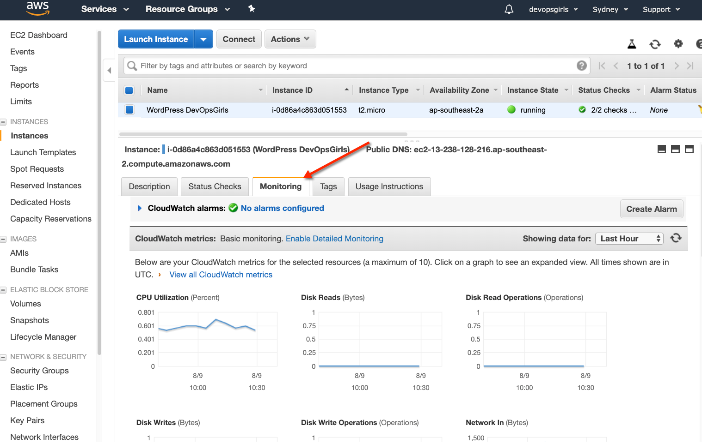
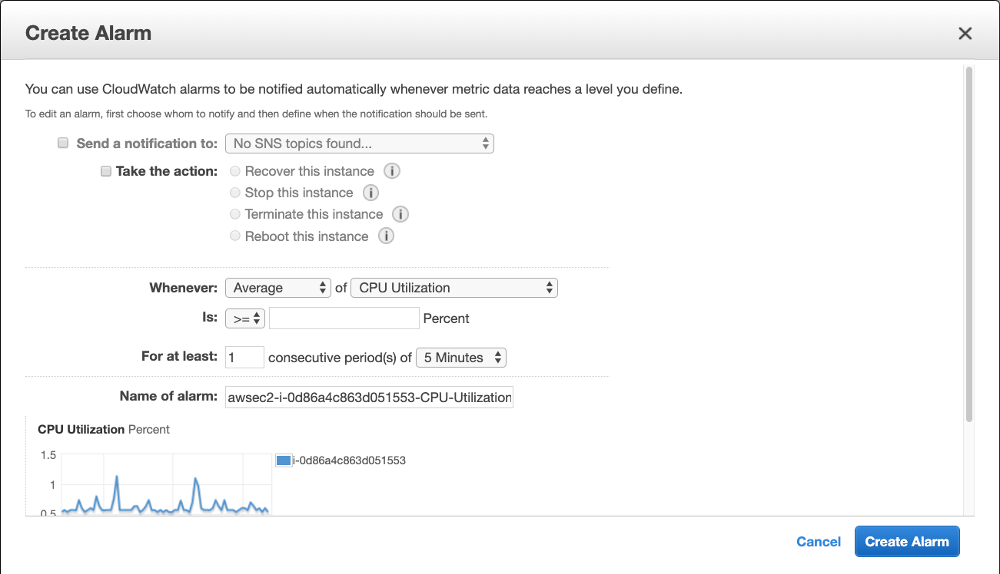
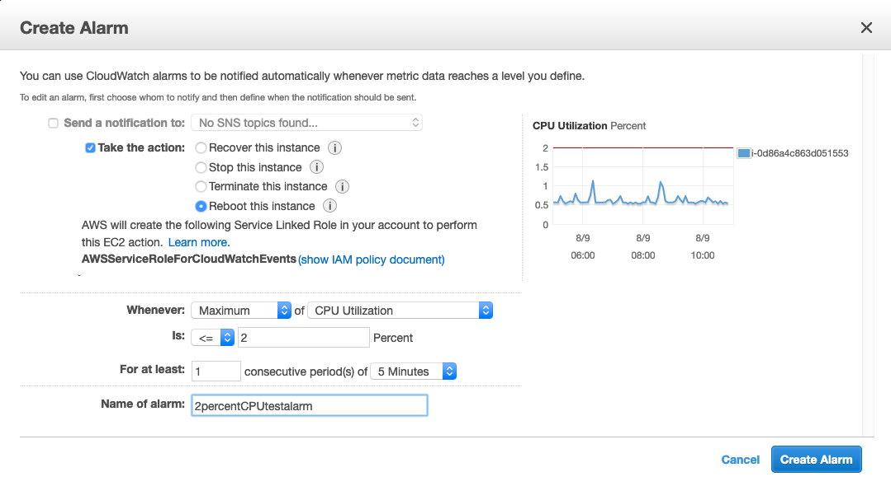
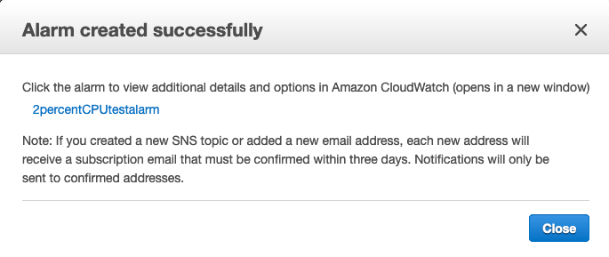
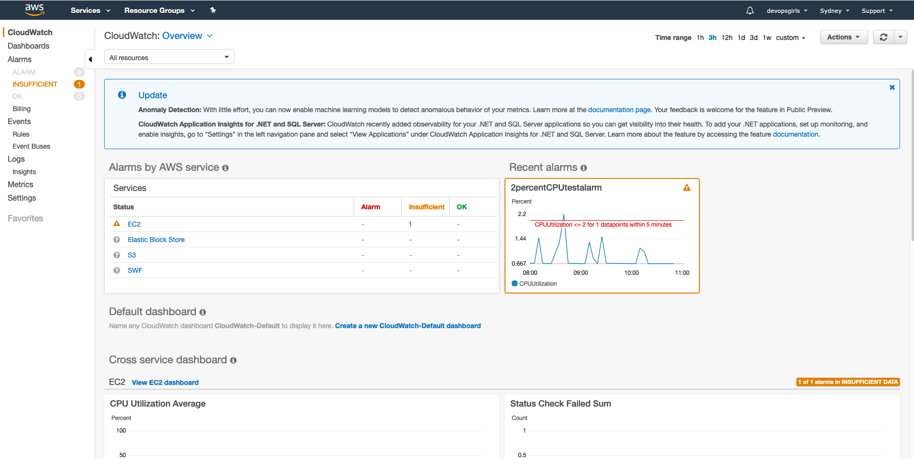
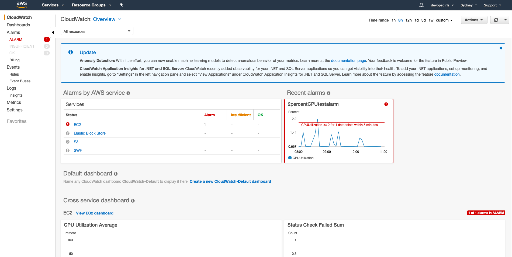
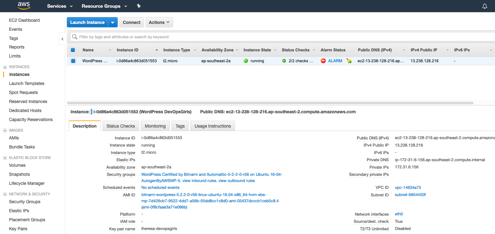
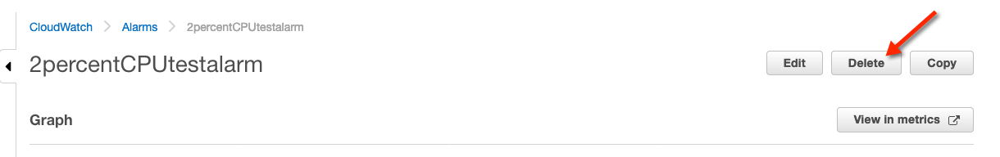
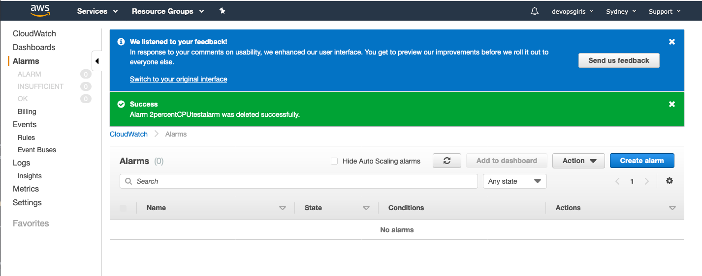
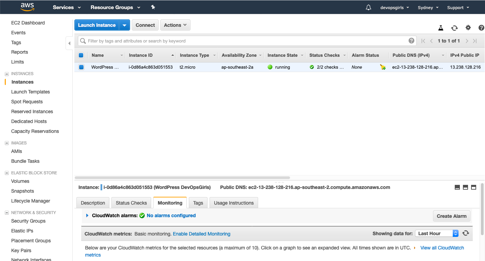

# Monitoring

Monitoring in effect is a type of feedback that testers too may greatly benefit from.

The topic itself is "so hot right now", including its cousin topic 'Observability'.

In the few minutes we have together today, we can hardly scratch the surface on how deep this field goes.

This exercise is just a taster to whet your appetite.

## Testers and Monitoring

Here's some of Theresa's initial thoughts on how Testing/QA are members of this conversation: https://devopsagenda.techtarget.com/opinion/Systems-thinking-principles-DevOps-and-the-support-pager

## Lots more information on the subject for all roles, here:
https://monitoring.love/articles/
***
## Monitoring and Alarming in AWS

### 1. Setting up a demo alarm

#### 1.1. View your EC2 instance, and select the **Monitoring** tab

#### 1.2. Just have a look around at what is currently being monitored

#### 1.3. Click on "Create Alarm"

(the button to the right)

This will bring up this page:

#### 1.4. Specify your alarm

We are providing criteria that will **obviously** alarm, for our demo purposes.

In our case, we are requiring an alarm if the Maximum CPU Utilisation is greater or lesser than 2. This will definitely alarm because you can see the CPU Utilisation is sitting in the region of 0.5 to 1.0.

Fill in the details and then click **Create Alarm**.

## Amazon CloudWatch

Amazon CloudWatch monitors your Amazon Web Services (AWS) resources and the applications you run on AWS in real time. You can use CloudWatch to collect and track metrics, which are variables you can measure for your resources and applications.

### 2. Navigate to the CloudWatch page

You will see your alarm listed. It may be in any state.

In the demo case, the status is currently "INSUFFICIENT". (The alarm has just started, the metric is not available, or not enough data is available for the metric to determine the alarm state)

#### 2.1. Wait up to 5 minutes

We know this will alarm within 5 minutes.

Refresh the page if you need to, and you will see the alarm state:

#### 2.2. See the alarm in the EC2 console

Just have a look to see how it displays.

Play around.

Click on the ALARM link in "Alarm Status".

Click on the "Monitoring" tab and see what you learn there.

When you are ready to move on, delete the alarm (next).

### 3. Delete your a demo alarm

In the alarm view in CloudWatch, click "Delete".

You will receive confirmation as follows:

### 4. You will notice it's no longer displayed in EC2 either

### End of demo alarm exercise
***
## Get creative

What else can you do with Monitoring and Alarms in AWS?
https://docs.aws.amazon.com/AmazonCloudWatch/latest/monitoring/AlarmThatSendsEmail.html

What is an SNS topic (and how can you use it)?
https://ap-southeast-2.console.aws.amazon.com/sns/v3/home?region=ap-southeast-2#/homepage
