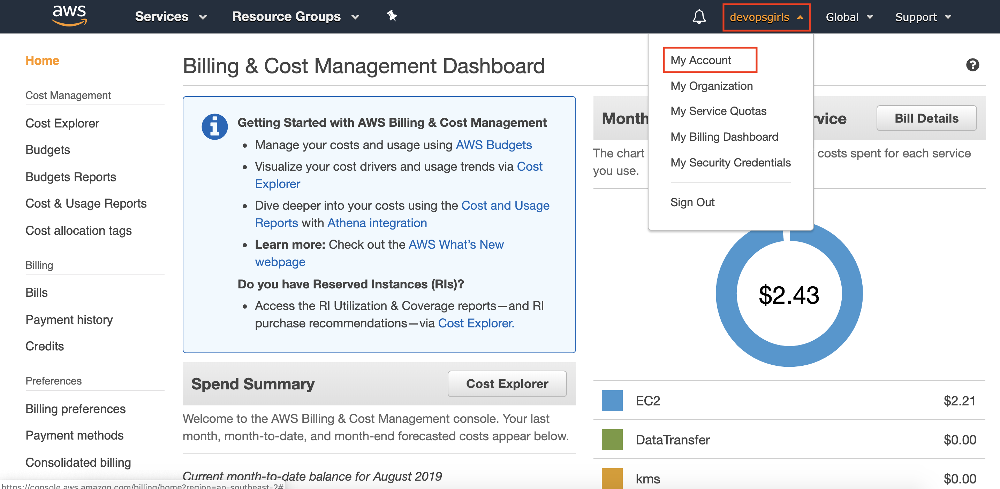

# Wrap Up

## Clean up your instances and buckets

Be sure to stop or terminate/delete any buckets, services and EC2 instances you are no longer using, or they may be billed to you.

## Keep an eye on billing

### Your account can be found at:

### Set up billing alerts:
https://docs.aws.amazon.com/AmazonCloudWatch/latest/monitoring/monitor_estimated_charges_with_cloudwatch.html#turning_on_billing_metrics

### More about the free tier:
http://docs.amazonwebservices.com/gettingstarted/latest/awsgsg-freetier/TestDriveFreeTier.html

## If you feel like homework, all our tutorials can be found on GitHub:
https://github.com/DevOps-Girls

## Recommended reading & meetups

### Meetups

https://www.meetup.com/DevOpsGirls/ 
https://www.meetup.com/PyLadies-Melbourne/ 
https://www.meetup.com/Women-Who-Code-Melbourne/ 
https://www.meetup.com/Tech-Leading-Ladies/  
https://www.meetup.com/Female-Coders-Lab-Melbourne/ 
https://www.meetup.com/Infrastructure-Coders/ 
https://www.meetup.com/Women-Who-Test/ 

### Reading

Continuous Delivery - Humble & Farley  
DevOps Handbook - Kim, Humble, Willis, Debois 
Infrastructure as Code: Managing Servers in the Cloud - Morris 
Just Culture - Dekker 
